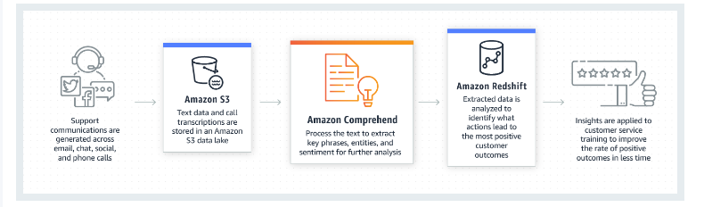

#### How to prevent deletion of important documents indefinitely using Amazon S3 Glacier Vault

1. Set a legal hold on the formulation document archive in the vault
2. Use vault lock policy to match the LegalHold tag and deny deletion of the formulation document archive

Vault Lock Policy: Provides a way to lock the vault's policy for a specified period or indefinitely, preventing changes to the policy after it is locked.

Legal Hold: Typically used in litigation or investigation scenarios where data needs to be preserved until the hold is removed. This would prevent deletion while the hold is in place.

#### How to deny all accounts in AWS org from creating an S3 bucket with public access

Enable Amazon S3 block public access on AWS org's service control policies(SCPs) to deny users making change to these settings

- SCPs (Service control policies) assist in centrally controlling permissions for all accounts in AWS Organizations. This helps to ensure that all the accounts in AWS Organizations are following the same access guidelines.
- Amazon S3 Block Public Access settings can be used to manage public access to Amazon S3 buckets. By default, all the new buckets created in Amazon S3 do not support public access. But users can change these settings to allow public access to the bucket.
- Block Public Access settings can be used to deny permission to users from making changes to public access to the bucket.
- SCP can be applied at the Organization Root-level to deny all accounts permission to make S3 buckets public.

#### What is used for accessing VPCs across different regions
VPC Peering - efficient for inter-region traffic and avoids public internet routing

#### How to provide connectivity between AWS VPCs and on-premises networks over the public internet?
VPN Connections

#### How to connect services across different accounts and VPCs without exposing traffic to the public internet?
AWS PrivateLink

#### What is the best AWS service for simple, direct VPC-to-VPC connections across different regions?
Inter-Region VPC Peering is the most suitable service for straightforward VPC-to-VPC connections across regions. It facilitates private IP communication between resources in different regions without requiring complex network setups, ensuring that traffic does not traverse the public internet.

#### Which AWS service should be used for managing complex multi-region network architectures that involve multiple VPCs and hybrid networks?
AWS Transit Gateway is ideal for large-scale or complex network environments involving multiple VPCs across regions. It acts as a central hub, simplifying the management of network connections and scaling dynamically with organizational needs, thus providing centralized management and monitoring.

#### What AWS solution is recommended for organizations requiring consistent, high-throughput, low-latency connections from on-premises data centers to AWS?
AWS Direct Connect is recommended for dedicated connectivity needs. It provides a direct connection from on-premises networks to AWS, bypassing the public internet. This service is crucial for applications that require consistent network performance, offering both reliability and enhanced security.

#### When should a VPN be used for connecting on-premises networks to AWS VPCs, especially across regions?
A VPN Connection is suitable when dedicated connectivity is impractical or too expensive. It securely extends an on-premises network to AWS VPCs over the internet and is particularly useful for organizations that need encrypted, flexible, and cost-effective connections without significant initial investments.

#### How can AWS services be utilized to securely connect services across different accounts and regions without exposing data to the public internet?
AWS PrivateLink is the best option for securely connecting services across VPCs and accounts without public internet exposure. It's especially useful for internal service sharing or connecting with external partners while minimizing the attack surface by avoiding public IP addresses and simplifying security management.

VPC Peering has cross region limitations

#### Which AWS service should I use to identify objects, people, text, scenes, and activities in images and videos, and to analyze facial details?
Amazon Rekognition is the ideal service for these tasks. It provides capabilities to identify various elements within images and videos, offers facial analysis, and has advanced search capabilities for detecting, analyzing, and comparing faces. 

#### I need a service for extracting text, handwriting, and other data from scanned documents, including forms and tables. Which AWS service should I use?
Amazon Textract is a fully managed machine learning service that automatically extracts printed text, handwriting, and other data from scanned documents. It goes beyond simple optical character recognition (OCR) to identify, understand, and extract data from forms and tables effectively.

#### Which AWS service is best for natural language processing to analyze text and uncover insights such as sentiment and relationships?
Amazon Comprehend is the best choice for natural language processing tasks. It utilizes machine learning to analyze text for sentiment, key phrases, entities, and language. It's primarily used for uncovering valuable insights and connections in text but is not suitable for text-to-speech conversions.

#### If I need to convert text into lifelike speech for creating applications that talk, which AWS service should I use?
Amazon Polly is the service designed for converting text into lifelike speech, enabling the development of applications that can speak and respond to users. It supports multiple languages and voices, making it ideal for building speech-enabled products and services.

#### How can I efficiently manage intermittent "too many connections" errors and performance slowdowns in an Amazon RDS MySQL database, especially when facing high demand and bursty traffic in an e-commerce environment?
 Use Amazon RDS Proxy. 
 - RDS Proxy acts as an intermediary service that pools and shares database connections, improving database efficiency and application scalability. This service helps manage the database connections by allowing them to be reused, which significantly reduces the connection overhead for applications that open and close connections frequently. 
 - Additionally, RDS Proxy enhances the ability to handle bursty workloads, which are common in e-commerce platforms, without needing to provision excess database connections, thus streamlining operations and reducing the chance of database performance bottlenecks.

#### How can I effectively track and record API calls between a web server and an application server to diagnose communication issues?
Use AWS CloudTrail for tracking and recording API calls. 

#### What AWS service should I use to perform automated security assessments to identify vulnerabilities or unintended network exposures in my applications?
Amazon Inspector

#### If I need to collect logs for troubleshooting and want a visual representation of service integrations and communications, which AWS service should I use?
AWS X-Ray 

#### For analyzing and debugging distributed microservices architecture, especially to understand communication between web and application servers, which AWS service offers the best integration and visualization tools?
Amazon X-Ray 

#### How can I perform real-time analytics(heavy queries) on transactional data without impacting the performance of my operational database?
Amazon Aurora Parallel Query is the optimal solution for this scenario. 
- It enables you to perform analytical queries directly on the data stored in your transactional Aurora MySQL database without the need to transfer data to a separate analytics system i.e. without slowing down your live database operations.

#### I need to analyze log data and monitor real-time applications without a dedicated analytics database. Which AWS service should I use?
Amazon OpenSearch (formerly known as Amazon Elasticsearch) is suitable for log analytics, real-time application monitoring, and clickstream analysis. 

#### For processing vast amounts of data for big data applications, which AWS service is recommended?
Amazon EMR (Elastic MapReduce) is recommended for big data processing use cases. It supports various big data frameworks, including Apache Hadoop and Apache Spark, and is ideal for tasks that require processing large datasets, complex analytics, and data transformations. EMR is particularly effective in environments where data is batch-processed from various sources.

#### Which AWS service should I use to create interactive dashboards and visualizations from my data sources for business intelligence?
Amazon QuickSight is the best choice for building interactive dashboards and visualizations. 

#### An organization is planning to move its employee self-service applications from on-premises data centers to AWS Cloud. The organization has millions of users in its Corporate Directory on-premises. They need a way to provide access to all applications that would be migrated to the cloud after users log in to their on-premises employee portal. Additionally, they aim to extend access to other cloud-based applications like Salesforce in the future. What is the best solution to have users on-premises access the applications in AWS?

The best solution in this scenario is to use AWS IAM Identity Center to sign-on users defined in the Corporate Directory on-premises with SAML 2.0 based identity federation for accessing the AWS applications. AWS IAM Identity Center is a cloud-based single sign-on service that allows for central management of single sign-on across different AWS accounts and cloud applications. It provides flexibility by integrating with AWS-managed Microsoft AD, on-premises AD services, and any identity provider that is SAML 2.0 compliant.

This approach allows the organization to leverage its existing on-premises identity provider and avoid duplicating users in IAM, ensuring a seamless integration and access management to cloud applications like Salesforce, Jenkins, and others directly through AWS IAM Identity Center, thereby aligning with the organization's requirements for a hybrid cloud model.

#### A company wants to monitor the performance of their EC2 instances, such as CPU utilization, and receive alerts when usage goes beyond 80%, potentially indicating performance issues or the need for scaling.
CloudWatch

#### A company needs to ensure that all administrative actions, such as launching or terminating EC2 instances, modifying security groups, or configuring other AWS services, are recorded for compliance with IT security standards and auditing.
CloudTrail

#### A company wants to aggregate, organize, and prioritize security alerts or findings across multiple AWS services using automated security checks based on AWS security best practices. Which AWS service should they use to manage this in a centralized manner?
AWS Security Hub

#### In a scenario where both security and operational issues need to be managed and remediated, which AWS service can provide detailed insights and data that can be used to understand and mitigate these concerns independently or in a combined manner?
AWS Systems Manager Ops Center

#### If a business needs to manage and remediate operational issues within their AWS environment, which service allows for the automation of these tasks and helps in ensuring operational health?
AWS Systems Manager

#### Which AWS service is used to protect applications from Distributed Denial of Service (DDoS) attacks, ensuring that applications remain available and performant?
AWS Shield

#### When a company needs to manage and remediate security issues within their AWS environment, which service offers capabilities to handle these security challenges effectively?
AWS Security Hub

#### An organization requires detailed assessments and remediation related to **network** accessibility of EC2 instances. Which AWS service can provide this type of security assessment information?
AWS Inspector

#### The Utopia Municipality Corporation runs its applications locally but has its database on an on-premise data center while keeping the application server in EC2. They need a solution that allows all AWS services to communicate seamlessly with their on-premises database without migrating or hosting it in the cloud, ensuring compliance and a consistent hybrid experience. What AWS service should they use?
- AWS Outposts delivers AWS infrastructure and services to virtually any on-premises or edge location, providing a truly consistent hybrid experience. It is fully managed and supports local processing and data residency, which aligns with the organization's requirement for low-latency access to on-premises systems without migrating the database to AWS.
- AWS DataSync is an online data transfer service that simplifies, automates, and accelerates moving data into AWS. Like Snowball Edge, it conflicts with the organization's policy against migrating their database to the cloud.
- While AWS Storage Gateway facilitates the integration of on-premises environments with cloud storage, it is primarily used for backup solutions and would not support the real-time, low-latency interaction required between AWS services and the on-premises database without hosting data in the cloud.

#### A company needs to continuously monitor and protect sensitive data such as personally identifiable information (PII) stored in Amazon S3 buckets. Which AWS service should they use to automatically discover, classify, and protect sensitive data in S3?
Amazon Macie. It uses machine learning and pattern matching to identify and safeguard sensitive data in Amazon S3 buckets. Macie automatically assesses S3 buckets to detect sensitive data and provides detailed reports of any findings.

#### An organization suspects that its AWS credentials have been compromised and wishes to identify any unusual access patterns to its Amazon S3 buckets. Which AWS service should they utilize to monitor and protect against the use of compromised credentials?
Amazon GuardDuty. It protects against compromised credentials and unusual access patterns to Amazon S3 but does not scan the contents of the buckets for sensitive data.

#### A security team needs to analyze security data from multiple AWS services to determine the root cause of security incidents in their AWS environment. Which service provides the analysis and visualization tools necessary for this task?
Amazon Detective. It analyzes and visualizes security data from services like Amazon GuardDuty, Amazon Macie, and AWS Security Hub to help uncover the root causes of security issues.

#### A company wants to ensure that its Amazon EC2 instances are not exposed to software vulnerabilities or risky network configurations. Which AWS service should they employ to evaluate the security posture of their EC2 instances?
Amazon Inspector. It assesses Amazon EC2 instances for software vulnerabilities and unintended network exposures, providing recommendations for security improvements.

#### A company needs to migrate their on-premises applications such as SAP, Oracle, and SQL Server to AWS without needing multiple migration-specific experts. Which AWS service should they use to ensure cost-effective migration with minimal disruption?
AWS Application Migration Service (AWS MGN). This service allows the migration of applications to AWS Cloud by initially replicating data to AWS, conducting necessary tests, and then performing a cutover with minimal disruption to application performance.

#### Which AWS service should a company use if it needs to gather detailed information about their on-premises data centers before planning a cloud migration?
AWS Application Discovery Service. This service helps in planning cloud migration by collecting detailed information about on-premises data centers, facilitating a more informed migration strategy.

#### A business needs to track the activities and status of their migration process in detail. Which AWS service offers the capability to monitor the activities performed during the migration?
AWS Migration Hub. Although not directly mentioned in the given text, AWS Migration Hub provides a central location to monitor and manage migrations from on-premises to AWS, offering detailed tracking capabilities.

#### If a company wants to ensure continuous data synchronization during migration without service interruption, which AWS service is suitable for migrating SQL Server databases from on-premises to AWS?
AWS DMS (Database Migration Service). AWS DMS supports the migration of SQL databases like SQL Server to AWS, maintaining synchronization between the source and target databases during the migration process.

#### An organization needs to ensure that a migrated application is fully functional and performing as expected on AWS before cutting over to production. What process or strategy should they adopt according to AWS best practices?
Using AWS Application Migration Service, the strategy would be to replicate the application data to AWS, perform thorough tests to validate business operations on AWS, and then execute a planned cutover to minimize disruption to application performance.

#### A company operating on AWS requires enhanced protection against DDoS attacks on its EC2 instances, ELB, Amazon CloudFront, AWS Global Accelerator, and Route 53 resources. They need a solution that offers real-time visibility of attacks and integration with AWS WAF for proactive mitigation strategies. Which AWS service should they use?
Amazon Shield Advanced. This service provides a higher level of protection against DDoS attacks, real-time visibility for the attacks, and can be integrated with AWS WAF to create proactive rules against these attacks. It also engages the AWS Shield Response Team (SRT) for further protection and mitigation strategies.

#### A small business using AWS wants basic protection against DDoS attacks for their resources like Elastic Load Balancing (ELB) and Amazon CloudFront without the need for real-time attack visibility or the intervention of a dedicated response team. Which AWS service would suit their needs?
AWS Shield Standard. This service automatically protects all AWS resources and is suitable for customers who need essential protection against DDoS attacks without the additional features and cost of AWS Shield Advanced.

#### An organization needs a comprehensive security solution to analyze logs from multiple AWS services like CloudTrail, VPC flow logs, and DNS query logs to understand and mitigate security issues, including DDoS attacks. Which AWS service should they consider to complement their use of AWS Shield?
Amazon Detective. This service analyzes logs from various AWS security services to help identify the root causes of security issues, providing insights that can be crucial for mitigating DDoS attacks effectively when used in conjunction with AWS Shield.

#### A high-profile media streaming company frequently targeted by sophisticated DDoS attacks requires a service that not only protects against such attacks but also offers the support of a response team to handle incidents as they occur. Which AWS service meets this requirement?
Amazon Shield Advanced. It not only provides protection against DDoS attacks but also includes the engagement of the AWS Shield Response Team (SRT), who are actively involved in managing and mitigating attacks.

#### A company needs to ensure their web applications are safeguarded against DDoS attacks and require updating WAF rules frequently as per the latest threat landscape. They also require service with proactive engagement during attacks. What should they opt for?
Amazon Shield Advanced with integration of AWS WAF. This combination allows for the dynamic updating of WAF rules and proactive engagement from the AWS Shield Response Team during DDoS attacks, ensuring robust security measures are in place.

#### An airline company needs to analyze customer feedback about services provided. A large number of files are created which have texts such as Ticket returns and Flight complaints based upon customer feedback. This text should be categorized, and a label needs to be assigned for further analysis. The company is planning to use Amazon Comprehend for this purpose. The project team is looking for your suggestions for storing files that Amazon Comprehend can use for processing and saving the results.

#### A fintech startup wants to create a conversational interface to help users inquire about stock prices and get investment advice directly through their application. What AWS service should they use to build this capability?

They should use **Amazon Lex**, a fully managed AI service designed for creating conversational interfaces for applications. It enables the integration of prebuilt chatbots which can interact with users for specific queries such as those in the capital market.

#### A global web platform wants to provide content in multiple languages to enhance user accessibility. Which AWS service should they use to automatically translate their content?

**Amazon Translate**

#### An online education platform wishes to enhance their video content by adding automated speech recognition to transcribe lectures. Which AWS service is suited for this task?

The platform should use **Amazon Transcribe**. This service provides automated speech recognition that can transcribe audio from lectures into text, making content more accessible and searchable for users.

#### An e-commerce company wants to tailor their product recommendations to each user's shopping habits and preferences. Which AWS service can help personalize user experiences on their platform?

**Amazon Personalize** would be the ideal service. It uses machine learning to customize applications, providing personalized recommendations to users based on their individual behaviors and preferences on the site.

#### Which AWS services can directly query data from Amazon S3 without the necessity of loading the data from S3 into them?
- Amazon Athena
- Amazon Redshift Spectrum
- Amazon S3 Select
- AWS Glue
- AWS Lake Formation

#### A company has its on-premises Active Directory infrastructure already in place and wants to extend its existing identities to AWS Cloud without setting up a full Microsoft AD on AWS. Which service should they use?
Active Directory Connector

#### An organization is looking to set up a standalone, managed directory on AWS to support Windows workloads that require Microsoft Active Directory, without relying on an existing on-premises AD. What is the best AWS service for this?
AWS Directory Service for Microsoft AD

#### A startup wants to manage user identities for their mobile and web applications, enabling functionalities such as user sign-up, sign-in, and access control without building their own backend for identity management. Which AWS service fits these needs?
Amazon Cognito

#### A company needs to migrate their on-premises application workloads to AWS. The migration includes complex applications and databases that must be carefully managed to ensure minimal downtime. Which service is not suitable for this specific type of data transfer?
AWS Server Migration Service (SMS) – An agentless service that makes it easier and faster to migrate thousands of on-premises workloads to AWS.

#### An enterprise is looking to create a hybrid storage environment where they can seamlessly integrate their on-premises storage with AWS services, allowing for frequent access to data stored on AWS as if it were local. Which service is can be used for this scenario?
Amazon Storage Gateway 

#### A business intends to migrate a large amount of data from Google Cloud Storage to an Amazon S3 bucket. They require a solution that can automate the transfer and handle large datasets efficiently. Which AWS service is perfect for this requirement?
AWS DataSync is the correct choice for transferring data between different storage systems and cloud services efficiently and can handle large amounts of data without extensive coding.

#### A multinational company needs to accelerate the transfer of large data sets to Amazon S3 across global locations to improve performance for their worldwide user base. The solution must integrate well with Amazon CloudFront to reduce latency. Which service would be the wrong option for directly migrating object storage between cloud providers?
S3 Transfer Acceleration is incorrect for direct cloud-to-cloud migrations as it is optimized for speeding up the transfer of data to S3 buckets globally via the internet, not for data migrations between cloud providers.

#### A company experiences daily peaks in web traffic that are predictable. They need a solution that allows them to prepare in advance to handle these surges without manual intervention. Which scaling strategy should they choose?
Use the Scheduled scaling type to scale out quickly

#### An online retailer needs to maintain application performance during sudden and unforeseen spikes in demand, such as flash sales, without keeping a high number of EC2 instances running all the time. What's the best strategy?
Use Warm Pool with Auto Scaling

#### A gaming company launches a new online game, which leads to a rapid increase in players. They need to immediately increase server capacity to ensure game performance remains steady. Which option should they use?
Use the Desired capacity parameter to scale out quickly

#### An IT company wants to ensure that their scaling processes allow for instances to properly initialize and configure software or load up-to-date data before they start serving traffic, but also want to control how these instances are terminated. What feature should they implement?
Use Lifecycle hooks with Auto Scaling